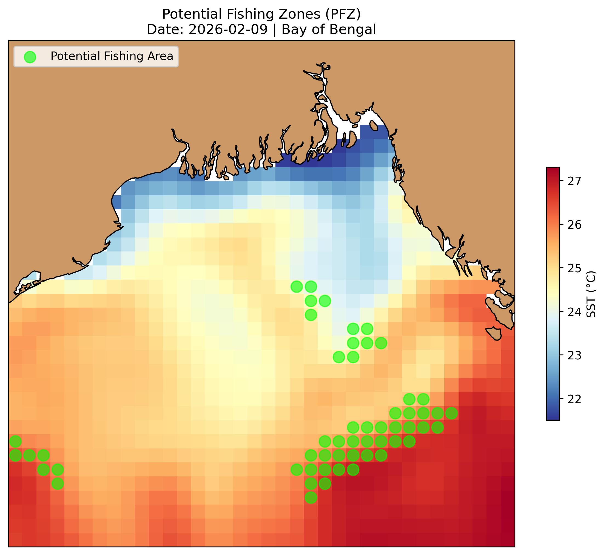

# pfz-automation
# 🐟 Automated Potential Fishing Zone (PFZ) Finder

This project automatically identifies fishing hotspots in the Bay of Bengal using satellite Sea Surface Temperature (SST) data.

## 📍 Latest Prediction

*Map updated daily at 03:00 UTC. Green dots represent thermal fronts where fish are likely to congregate.*
